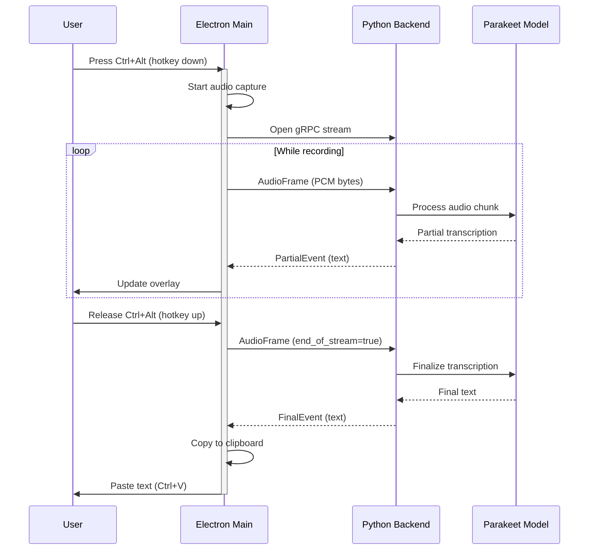
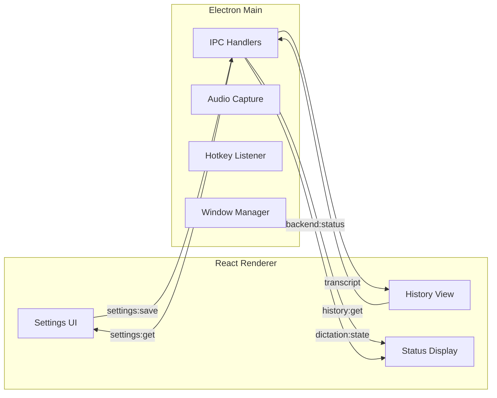
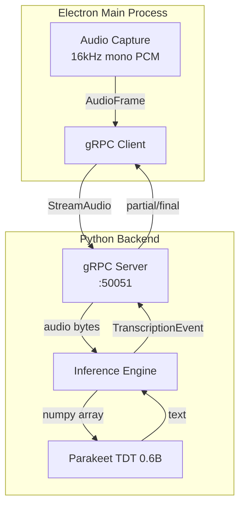

# KeyMuse

Speech-to-text dictation app for Windows. Press a hotkey, speak, release - text appears anywhere.

## Features

- **Push-to-talk dictation** - Hold hotkey to record, release to transcribe
- **System-wide** - Works in any application
- **Fast & accurate** - Uses NVIDIA Parakeet model for real-time transcription
- **Minimal UI** - Lives in system tray with floating overlay
- **Configurable hotkeys** - Ctrl+Alt, Ctrl+Shift, Alt+Shift, or Win+Alt

## Quick Start

### Download & Install

Download the latest release from the [Releases](https://github.com/yourusername/keymuse/releases) page and run the installer.

### First Run

1. Launch KeyMuse
2. Wait for the model to download (~2GB, one-time)
3. Once ready, press **Ctrl+Alt** (default) to dictate
4. Release to insert transcribed text

## Architecture

KeyMuse uses a hybrid architecture with an Electron desktop app communicating with a Python backend for AI inference.

```
┌─────────────────────────────────────────────────────────────────┐
│                        KeyMuse Desktop                          │
├─────────────────────────────────────────────────────────────────┤
│  ┌─────────────────┐    ┌─────────────────┐    ┌─────────────┐ │
│  │   React UI      │    │  Electron Main  │    │   Python    │ │
│  │   (Renderer)    │◄──►│    Process      │◄──►│   Backend   │ │
│  │                 │IPC │                 │gRPC│             │ │
│  └─────────────────┘    └─────────────────┘    └─────────────┘ │
│         │                       │                     │        │
│         │                       │                     │        │
│    Settings UI            Audio Capture         NeMo/Parakeet  │
│    History View           Hotkey Detection      GPU Inference  │
│    Status Display         Clipboard/Paste       Transcription  │
└─────────────────────────────────────────────────────────────────┘
```

### Component Overview

| Component | Technology | Responsibility |
|-----------|------------|----------------|
| **UI (Renderer)** | React + TypeScript | Settings, history, status display |
| **Main Process** | Electron + Node.js | Window management, IPC, audio capture, hotkeys |
| **Backend** | Python + NeMo | AI model loading, speech-to-text inference |
| **Communication** | gRPC | Streaming audio to backend, receiving transcriptions |

## Communication Flow

### Dictation Sequence



### IPC Communication (Renderer ↔ Main)



### gRPC Protocol (Main ↔ Backend)



## Project Structure

```
KeyMuse/
├── apps/
│   └── desktop/              # Electron desktop application
│       ├── electron/         # Main process code
│       │   ├── main.ts       # App entry, window management
│       │   ├── audio.ts      # Audio capture (naudiodon)
│       │   ├── hotkeys.ts    # Global hotkey detection
│       │   ├── grpc-client.ts # Backend communication
│       │   └── settings.ts   # User preferences
│       ├── src/              # Renderer (React UI)
│       │   ├── App.tsx       # Main UI component
│       │   └── App.css       # Styles
│       └── public/           # Static assets
├── backend/                  # Python speech recognition
│   └── src/keymuse_backend/
│       ├── server.py         # gRPC server entry
│       ├── service.py        # Dictation service
│       ├── engine.py         # Inference orchestration
│       └── model.py          # NeMo model wrapper
└── shared/
    └── proto/
        └── dictation.proto   # gRPC service definition
```

## Development

### Prerequisites

- Node.js 18+ and Bun
- Python 3.11 or 3.12
- NVIDIA GPU with CUDA support

### Setup

```bash
# Clone the repository
git clone https://github.com/yourusername/keymuse.git
cd keymuse

# Install Electron app dependencies
cd apps/desktop
bun install

# Run in development mode
bun run dev
```

### Building

```bash
# Build distributable
cd apps/desktop
bun run dist
```

Output: `apps/desktop/dist/KeyMuse Setup.exe`

## Configuration

Settings are stored in `%APPDATA%/keymuse-desktop/settings.json`:

| Setting | Default | Description |
|---------|---------|-------------|
| `hotkey.preset` | `"ctrl+alt"` | Dictation shortcut |
| `overlay.enabled` | `true` | Show floating overlay |
| `overlay.position` | `"top-right"` | Overlay screen position |
| `startMinimized` | `true` | Start in system tray |

## Requirements

- **OS:** Windows 10/11
- **Python:** 3.11 or 3.12 (auto-detected or set `KEYMUSE_PYTHON`)
- **GPU:** NVIDIA with CUDA support (RTX recommended)
- **Disk:** ~3GB (model cache)
- **RAM:** 8GB+ recommended

## Troubleshooting

### "Python not found"
Install Python 3.11+ from [python.org](https://python.org) or Microsoft Store.

### "Numpy is not available"
Run: `%APPDATA%/keymuse-desktop/python/.venv/Scripts/python.exe -m pip install "numpy<2" --force-reinstall`

### Transcription is slow
Ensure CUDA is available. Check GPU usage in Task Manager during dictation.

### Hotkey doesn't work
Some applications capture hotkeys globally. Try a different hotkey combination in Settings.

## License

MIT
